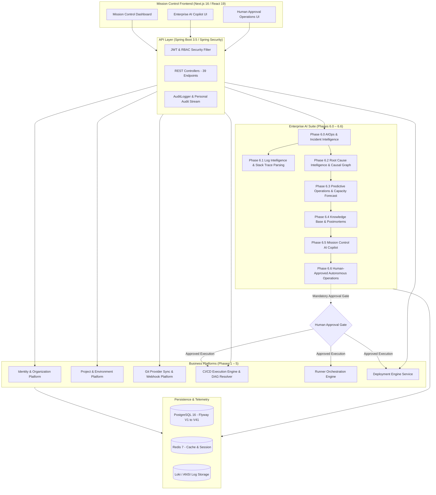

# CloudForge AI — Enterprise Cloud Operations & AIOps Platform (v1.0.0)

[](https://github.com/cloudforge-ai/cloudforge-ai)
[](https://openjdk.org/)
[](https://spring.io/projects/spring-boot)
[](https://nextjs.org/)
[](https://www.typescriptlang.org/)
[](LICENSE)

An enterprise-grade, AI-augmented internal developer platform and AIOps control plane that unifies CI/CD, repository governance, observability, root cause analysis, predictive operations, and human-approved autonomous operations.

---

## 🏛️ Platform Architecture



---

## ✨ Enterprise Capabilities

- **Identity & Organization Platform (Phases 1 - 2)**: Multi-tenant organization isolation, JWT rotation, MFA, granular RBAC (`@RequirePermission`), user preferences, and audit logging.
- **Project & Repository Platform (Phases 3 - 4)**: GitHub/GitLab/Bitbucket OAuth 2.0 integration, AES-256-GCM token encryption, branch sync, commit stream analytics, PR governance, and secret scanning.
- **CI/CD Platform & Execution Engine (Phase 5)**: DAG stage resolution, Docker/K8s/Self-Hosted runner orchestration, live ANSI log streaming, artifact repositories, and zero-downtime deployment adapters.
- **Enterprise AI Platform (Phases 6.0 - 6.6)**:
  - **Phase 6.0 AIOps**: Incident detection and pre-flight risk prediction.
  - **Phase 6.1 Log Intelligence**: Intelligent log parsing, error clustering, and stack trace analysis.
  - **Phase 6.2 Root Cause Intelligence**: Cross-service dependency graphs and causal failure chains.
  - **Phase 6.3 Predictive Operations**: Failure forecasting, capacity prediction, and runner utilization metrics.
  - **Phase 6.4 Knowledge & Runbooks**: Versioned playbooks, historical incident similarity matching, and AI postmortem generation.
  - **Phase 6.5 Enterprise Copilot**: Multi-domain operational assistant with intent routing and context aggregation.
  - **Phase 6.6 Autonomous Operations**: 7-component remediation planning, Human Approval Gate enforcement, and execution delegation.

---

## 🚀 Quick Start (Local Docker Compose)

```bash
# 1. Clone repository
git clone https://github.com/cloudforge-ai/cloudforge-ai.git
cd cloudforge-ai

# 2. Configure environment
cp .env.example .env

# 3. Start complete stack
docker compose up --build -d

# Access endpoints:
# Mission Control UI: http://localhost:3000
# Backend API Health: http://localhost:8000/health
# OpenAPI Docs:       http://localhost:8000/swagger-ui/index.html
```

---

## 🧪 Automated Testing & Verification

```bash
# Backend Automated Test Suite (156 passing tests across 313 Java files)
cd services/api
JAVA_HOME=/Library/Java/JavaVirtualMachines/jdk-24.jdk/Contents/Home ./mvn_dist/apache-maven-3.9.9/bin/mvn clean test -Dmaven.repo.local=./.m2/repository

# Frontend Typecheck, Lint & Next.js Production Build (55 SPA routes)
cd apps/web
npm run lint && npm run typecheck && npm run build
```

---

## 📄 License & Versioning

CloudForge AI is licensed under the Apache License 2.0. See [LICENSE](LICENSE) for details.  
Current Version: **v1.0.0 (Officially Released)**
