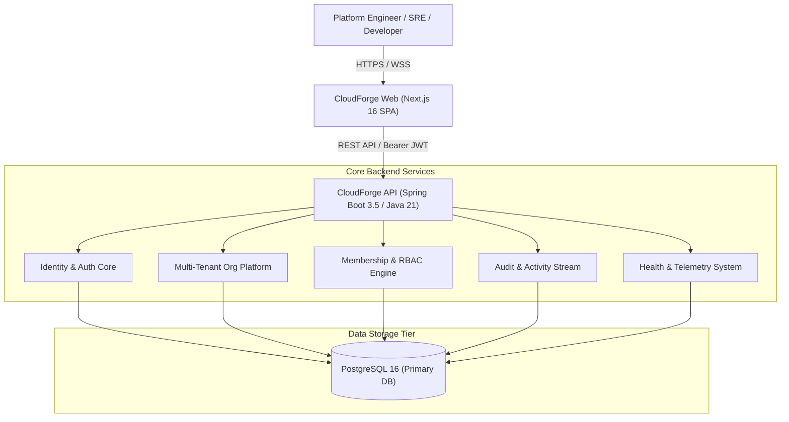

# CloudForge AI — System Architecture & Design Specification

## Overview
CloudForge AI is an enterprise-grade Cloud Operations & Internal Developer Platform (IDP) unifying Kubernetes workload management, CI/CD pipeline orchestration, observability telemetry, identity access control, and incident response into a single control plane.

---

## High-Level Architecture (C4 Context Model)

---

## Key Architectural Principles

1. **Clean Architecture & Domain Isolation**:
   - Controller Layer: Request validation, DTO mapping, REST serialization.
   - Service Layer: Business rules, transaction boundaries (`@Transactional`), permission checks.
   - Repository Layer: JPA Repositories with tenant filtering.
   - Entity Layer: Highly normalized JPA entities with lifecycle hooks (`@PrePersist`, `@PreUpdate`).

2. **Thread-Local Tenant Isolation (`TenantContext`)**:
   - Every incoming REST request extracts the Organization context.
   - `TenantContext.setTenantId(orgId)` stores the active tenant context in ThreadLocal storage during request lifecycle.
   - Ensures zero cross-tenant data leakage.

3. **6-Role Enterprise RBAC Matrix**:
   - `OWNER`: Full administrative control, ownership transfer, danger zone operations.
   - `ADMIN`: Team management, member invitations, pipeline triggers.
   - `DEVELOPER`: Deployment management, pod log inspection, pipeline execution.
   - `DEVOPS`: Kubernetes cluster scaling, namespace management, secrets access.
   - `SECURITY`: Vulnerability triage, compliance reports, audit log analysis.
   - `VIEWER`: Strictly read-only access across all dashboard modules.

4. **Mission Control Design System**:
   - Color Palette: Dark Slate Base (`#0A1020`), Panel Base (`#111B2E`), Border (`#22314D`), Phosphor Teal Accent (`#3DD9C4`), Healthy Green (`#34D399`), Warning Amber (`#FBBF24`), Critical Red (`#F87171`).
   - Typography: Space Grotesk (Headings), Inter (Body UI), JetBrains Mono (Code/Logs).
