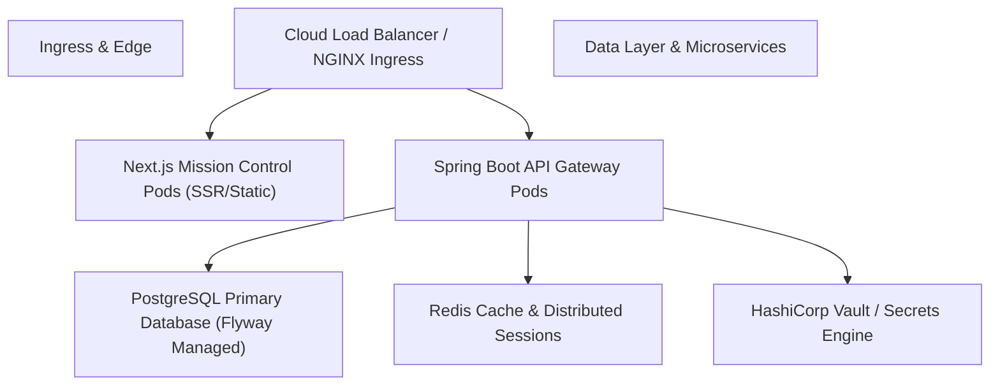

# CloudForge AI — Deployment Architecture

## Production Infrastructure Topology

```mermaid
graph TD
    SubGraph1["Ingress & Edge"]
    LB["Cloud Load Balancer / NGINX Ingress"] --> Web["Next.js Mission Control Pods (SSR/Static)"]
    LB --> API["Spring Boot API Gateway Pods"]

    SubGraph2["Data Layer & Microservices"]
    API --> PG["PostgreSQL Primary Database (Flyway Managed)"]
    API --> Redis["Redis Cache & Distributed Sessions"]
    API --> Vault["HashiCorp Vault / Secrets Engine"]
```
