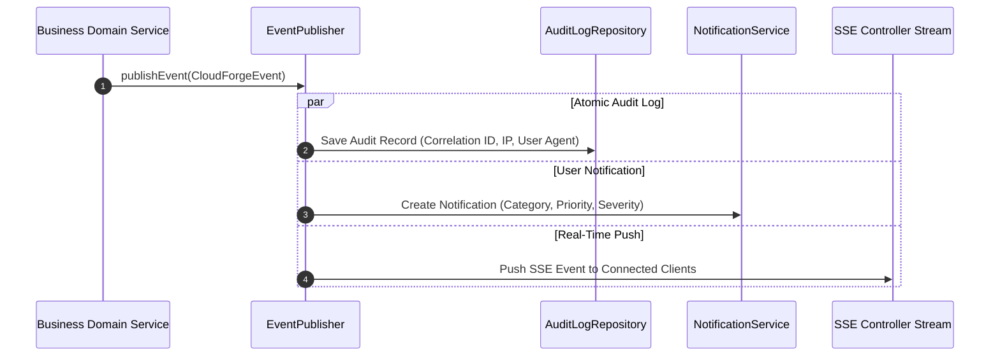

# CloudForge AI — Event Flow Architecture

## Domain Event Publication & Broadcast

```mermaid
sequenceDiagram
    autonumber
    participant Service as Business Domain Service
    participant Bus as EventPublisher
    participant Audit as AuditLogRepository
    participant Notify as NotificationService
    participant Stream as SSE Controller Stream

    Service->>Bus: publishEvent(CloudForgeEvent)
    par Atomic Audit Log
        Bus->>Audit: Save Audit Record (Correlation ID, IP, User Agent)
    and User Notification
        Bus->>Notify: Create Notification (Category, Priority, Severity)
    and Real-Time Push
        Bus->>Stream: Push SSE Event to Connected Clients
    end
```
