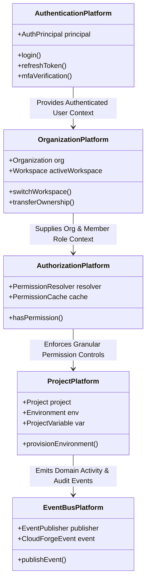

# CloudForge AI — Module Architecture Diagram

## High-Level Module Structure

```mermaid
classDiagram
    class AuthenticationPlatform {
        +AuthPrincipal principal
        +login()
        +refreshToken()
        +mfaVerification()
    }
    class OrganizationPlatform {
        +Organization org
        +Workspace activeWorkspace
        +switchWorkspace()
        +transferOwnership()
    }
    class AuthorizationPlatform {
        +PermissionResolver resolver
        +PermissionCache cache
        +hasPermission()
    }
    class ProjectPlatform {
        +Project project
        +Environment env
        +ProjectVariable var
        +provisionEnvironment()
    }
    class EventBusPlatform {
        +EventPublisher publisher
        +CloudForgeEvent event
        +publishEvent()
    }

    AuthenticationPlatform --> OrganizationPlatform : Provides Authenticated User Context
    OrganizationPlatform --> AuthorizationPlatform : Supplies Org & Member Role Context
    AuthorizationPlatform --> ProjectPlatform : Enforces Granular Permission Controls
    ProjectPlatform --> EventBusPlatform : Emits Domain Activity & Audit Events
```
