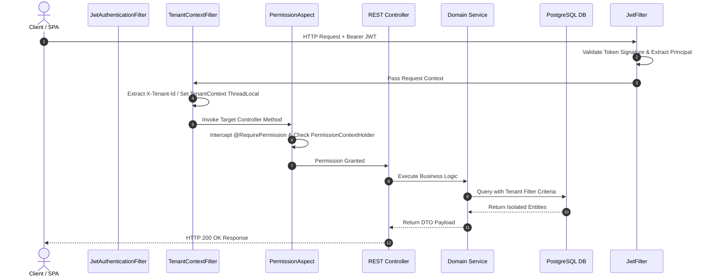

# CloudForge AI — Request Flow Architecture

## HTTP Request Pipeline Sequence

```mermaid
sequenceDiagram
    autonumber
    actor User as Client / SPA
    participant JWTFilter as JwtAuthenticationFilter
    participant TenantFilter as TenantContextFilter
    participant Aspect as PermissionAspect
    participant Controller as REST Controller
    participant Service as Domain Service
    participant Database as PostgreSQL DB

    User->>JwtFilter: HTTP Request + Bearer JWT
    JwtFilter->>JwtFilter: Validate Token Signature & Extract Principal
    JwtFilter->>TenantFilter: Pass Request Context
    TenantFilter->>TenantFilter: Extract X-Tenant-Id / Set TenantContext ThreadLocal
    TenantFilter->>Aspect: Invoke Target Controller Method
    Aspect->>Aspect: Intercept @RequirePermission & Check PermissionContextHolder
    Aspect->>Controller: Permission Granted
    Controller->>Service: Execute Business Logic
    Service->>Database: Query with Tenant Filter Criteria
    Database-->>Service: Return Isolated Entities
    Service-->>Controller: Return DTO Payload
    Controller-->>User: HTTP 200 OK Response
```
