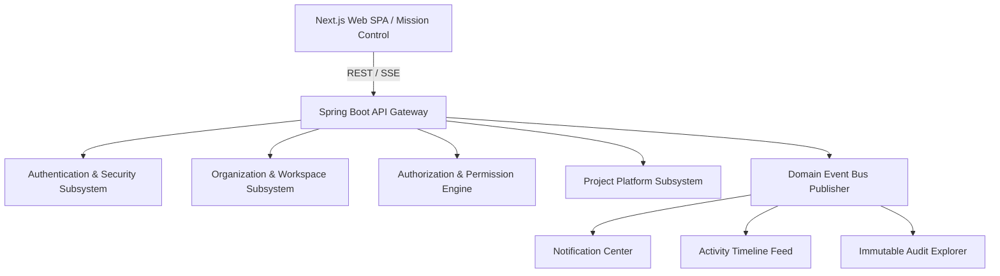

# CloudForge AI — System Architecture Overview

## 1. System Vision & Architecture Principles
CloudForge AI is an enterprise-grade, multi-tenant Cloud Operations & Developer Platform inspired by GitHub Enterprise, Atlassian Cloud, Azure DevOps, and Google Cloud IAM.

### Key Architectural Pillars
- **Strict Multi-Tenant Isolation**: Request-level context filtering via ThreadLocal `TenantContext` guarding database access.
- **Granular RBAC & ABAC Engine**: AOP-driven method security (`@RequirePermission`) with dynamic ThreadLocal permission resolution (`PermissionContextHolder`).
- **Domain Event Bus Architecture**: Synchronous and asynchronous domain event publication (`EventPublisher`) feeding notification streams, activity feeds, and immutable audit trails.
- **Mission Control Dark Theme UI**: High-density, reactive frontend built on Next.js 16 (Turbopack), React 19, TypeScript, and TailwindCSS.

---

## 2. Core Subsystems

---

## 3. Technology Stack Summary
- **Backend Framework**: Java 21/24, Spring Boot 3.5, Spring Security, Spring Data JPA, Lombok, Flyway Migrations (V1–V17).
- **Frontend Framework**: Next.js 16 (Turbopack), React 19, TypeScript, TailwindCSS, Lucide Icons.
- **Persistence**: PostgreSQL, Redis, Flyway Schema Versioning.
