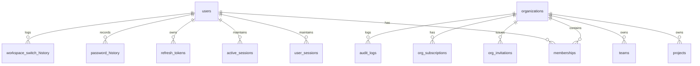

# CloudForge AI — Database Schema & Migration Specification

## Database Architecture
- **DBMS**: PostgreSQL 16
- **Migration Framework**: Flyway
- **Schema Management**: Fully versioned SQL scripts located in `services/api/src/main/resources/db/migration/`

---

## Flyway Migration Log

| Version | Migration Script | Description |
| :--- | :--- | :--- |
| **V1** | `V1__init_schema.sql` | Core identity tables (`users`, `organizations`, `memberships`, `projects`, `audit_logs`). |
| **V2** | `V2__add_system_health.sql` | System health check and telemetry tables. |
| **V3** | `V3__identity_and_teams.sql` | Teams, team memberships, org invitations, notifications, user sessions. |
| **V4** | `V4__auth_core_and_sessions.sql` | Refresh tokens, active device sessions, password history, login attempts tracking. |
| **V5** | `V5__multi_tenancy_and_subscriptions.sql` | Extended org metadata (`description`, `logo_url`, `status`, `primary_color`), subscription plans (`org_subscriptions`), usage metrics (`org_usage_metrics`). |
| **V6** | `V6__membership_and_invitations.sql` | Invitation attempt tracking (`attempts_count`, `resent_at`, `cancelled_at`), membership status (`status`), role change history (`membership_role_history`). |
| **V7** | `V7__activity_timeline_and_workspace_history.sql` | Audit log metadata fields (`actor_email`, `ip_address`, `metadata_json`), workspace switch history (`workspace_switch_history`). |

---

## Entity Relationship Diagram (ERD)

