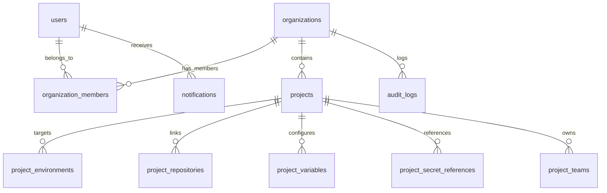

# CloudForge AI — Database Entity-Relationship Diagram

```mermaid
erDiagram
    users ||--o{ organization_members : belongs_to
    organizations ||--o{ organization_members : has_members
    organizations ||--o{ projects : contains
    projects ||--o{ project_environments : targets
    projects ||--o{ project_repositories : links
    projects ||--o{ project_variables : configures
    projects ||--o{ project_secret_references : references
    projects ||--o{ project_teams : owns
    users ||--o{ notifications : receives
    organizations ||--o{ audit_logs : logs
```
