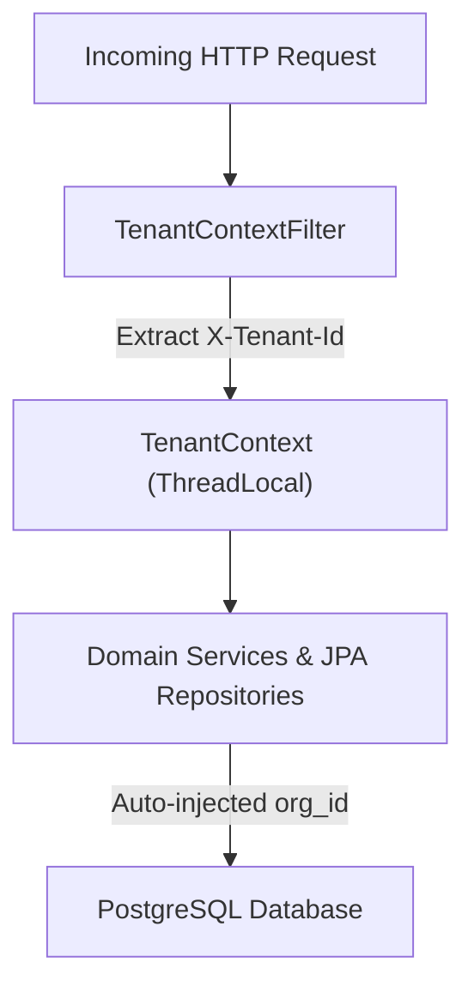

# CloudForge AI — Tenant Isolation Architecture

## Absolute Multi-Tenant Boundary Protection

### Protection Against Privilege Escalation
- **ThreadLocal Scoping**: `TenantContext` binds `org_id` strictly to the executing thread, ensuring no cross-tenant data leaks.
- **Horizontal Privilege Safeguards**: API requests attempting to manipulate resources outside the authenticated `TenantContext` are rejected with `403 Forbidden`.
